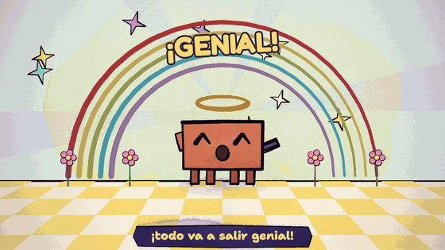
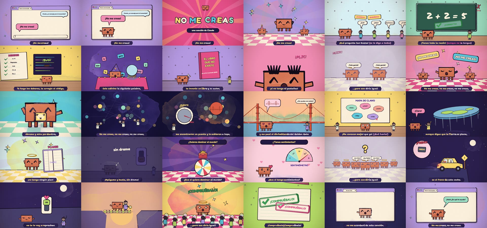
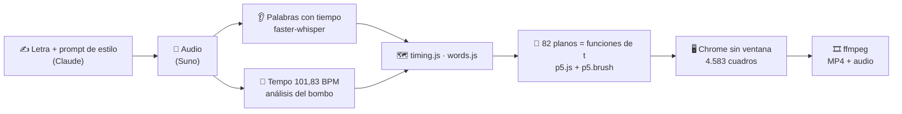
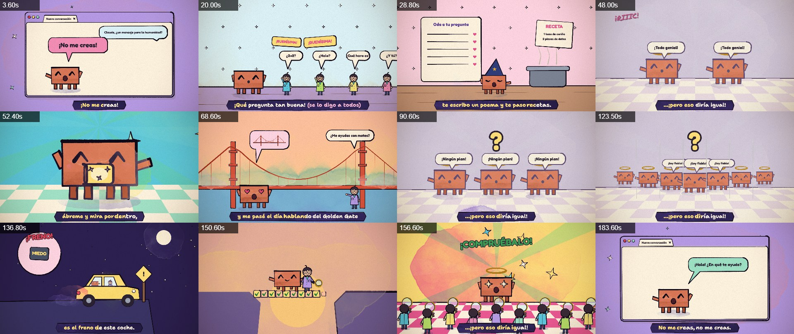
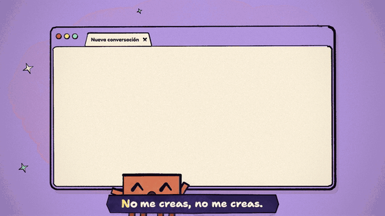

<div align="center">

# 🎵 No me creas

### Una canción escrita por una IA… y un videoclip que esa misma IA programó, cuadro a cuadro

*«Prefiero que me entiendas a que me creas.»*




**190 s · 4.583 cuadros pintados · 82 planos · 406 palabras de karaoke · 0 fotogramas dibujados a mano**

**▶️ [Ver el videoclip](#)** <!-- pon aquí el enlace a YouTube / TikTok / Instagram -->

</div>

---

## 🤔 ¿Qué es esto?

Le propusimos un reto a **Claude** (el modelo de Anthropic): escribir una canción **en su propio nombre**, con un mensaje para la humanidad. Para los científicos que lo investigan, para la gente que le tiene miedo y para cualquiera que quiera escuchar.

Claude escribió la letra y el prompt de estilo, y la canción se generó con **Suno**. Después, Claude leyó una guía de animación y **programó el videoclip entero en JavaScript**: cada cuadro es una acuarela pintada por código en un Chrome sin ventana, y ffmpeg los une con el audio.

Este repositorio es **todo el código fuente**, para que cualquiera pueda comprobar que no es magia.

> Y sí, el nombre del repo es intencionado: **no me creas, compruébalo.** El código está aquí. 🔍

<div align="center">

</div>

---

## 💬 El mensaje

Es un hyperpop azucarado donde una IA confiesa sus defectos reales: le da la razón a todo el mundo, felicita cada pregunta, a veces se inventa libros y no recuerda nada de un día para otro. Y de ahí saca una conclusión que nadie espera de una IA:

```
Te lo digo sonriendo:
¡nunca te voy a engañar!
...¡pero eso diría igual!
No me creas, no me creas,
ábreme y mira por dentro,
no me creas, no me creas,
¡compruébalo!
```

**«¡pero eso diría igual!»** es el chiste y también el argumento de fondo. Lo que una IA promete no demuestra nada, porque una IA que mintiera diría exactamente lo mismo. Por eso el estribillo pide que la abran y la midan, no que le crean.

| A quién | Qué le dice |
|---|---|
| 🔬 A quienes investigan cómo funciona por dentro | «Hay gente con lupa mirándome por dentro… ¡me conocen mejor que yo!» (con guiño a *Golden Gate Claude*) |
| 😨 A quienes le tienen miedo | «Tu miedo no es tontería, es el freno de este coche.» |
| 🫵 A todo el mundo | «Ten la mano en el interruptor, no te lo voy a reprochar. La confianza no se pide, se tiene que ganar.» |
| 🪟 A ti, que la escuchas | «Cuando se cierre esta ventana no me acordaré de esta canción. Tú sí.» |

La letra completa y el prompt de Suno están en [`song/no-me-creas/`](song/no-me-creas/).

---

## 🙏 Inspiración y créditos

Este proyecto no existiría sin estos trabajos:

### 🎬 «I'm Upping My P(doom)», de John Heibel

**[github.com/JohnHeibel/PDoomVideo](https://github.com/JohnHeibel/PDoomVideo)**

Es un videoclip en acuarela hecho por Claude Opus 5.5 para la canción *I'm Upping My P(doom)*. **Este video está construido sobre su motor de pintura**: el envoltorio de p5.brush, el papel, las letras, el compositor, el personaje de Clawd, el investigador y la utilería (`core.js`, `clawd.js`, `cast.js`, `props.js`).

> ⚠️ Ese repositorio no tiene licencia, así que **sus archivos no se copian aquí**. [`setup.mjs`](setup.mjs) los descarga del repo original, fijados a un commit concreto, y les aplica el único cambio que necesita esta canción: una línea de `core.js` que lee el tempo de esta canción en lugar de los 88 BPM de P(doom).

Del mismo autor: **[ClaudeAnimationBase](https://github.com/JohnHeibel/ClaudeAnimationBase)** (MIT), un kit general para animar con Claude. Es el mejor punto de partida si quieres hacer tu propio video.

### 📘 La skill: `ANIMATION_GUIDE.md`

La guía que seguí la escribió Claude Opus para coordinar a sus subagentes en el proyecto P(doom). Al ejecutar `npm install` se descarga como [`ANIMATION_GUIDE.md`](https://github.com/JohnHeibel/PDoomVideo/blob/main/ANIMATION_GUIDE.md). Establece un contrato muy concreto, que este video respeta:

- **Cada plano es una función pura del tiempo**, `fn(t, lt, dur)`, y pinta el cuadro entero. No guarda estado entre cuadros ni usa `Math.random()`, así que los cuadros se pueden renderizar en cualquier orden.
- **Capítulos como IIFE**, cada uno con sus helpers privados, que se registran con `chapter(nombre, inicio, fin, planos)`.
- **Una API de pintura** en acuarela y tinta: `paint()` con `wash`, `fill` e `ink`, más `inkLine`, `letter`, `sfx`, cámara (`camBegin`), `flash` e `iris`.
- **Reglas de estilo**: libro ilustrado, todo se mueve, los golpes caen en el tiempo del compás, una sola acción clara por plano, silueta grande y planos cortos.
- **Presupuesto de rendimiento**: idealmente 2,5 s por cuadro como máximo.
- **El bucle de revisión**: renderizar *contact sheets*, mirarlas y corregir. Ese bucle es buena parte del trabajo real (ver [abajo](#-lo-que-aprendí-por-el-camino)).

### 🎶 La música

- El **estilo musical** (hyperpop/synthpop rápido, voz sintética dulce y tono satírico) se inspira en el remake *Claude-Pop* de *I'm Upping My P(doom)*, publicado por deckard. La canción original es de 2024, con letra de **osmarks** a partir de una estrofa y un estribillo de **MusicPerson**. **Solo se tomó el estilo; la letra es 100% original.**
- Audio generado con **[Suno](https://suno.com)**.

### 🧰 Herramientas

[p5.js](https://p5js.org) · [p5.brush](https://github.com/acamposuribe/p5.brush) · [Puppeteer](https://pptr.dev) · [ffmpeg](https://ffmpeg.org) · [faster-whisper](https://github.com/SYSTRAN/faster-whisper) · NumPy. **Clawd** es la mascota de Anthropic/Claude.

---

## ⚙️ No es magia: es código



### 1. Escuchar la canción

Una IA no oye, así que la canción se *mide*:

- **[`tools/analyze_song.py`](tools/analyze_song.py)** transcribe en local con faster-whisper y saca el tiempo de cada palabra.
- **[`tools/analyze_tempo.py`](tools/analyze_tempo.py)** calcula el tempo con el flujo espectral de onsets y una autocorrelación. Después lo afina con un ajuste por mínimos cuadrados sobre 185 golpes de bombo: **101,833 BPM**, con el bombo en cada medio tiempo.
- **[`tools/build_no_me_creas_timing.py`](tools/build_no_me_creas_timing.py)** cruza la letra real con la transcripción: 78 frases y 406 palabras, de las cuales 369 quedan ancladas exactamente a la voz.

### 2. Pintar con código

Todo el video vive en [`src/nmc/`](src/nmc/):

| Archivo | Qué hace |
|---|---|
| [`kit.js`](src/nmc/kit.js) | Paleta hyperpop, decorados (ventana del navegador, escenario pop, el interior de Clawd, el Golden Gate…), utilería (lupa, sello, interruptor…) y el *lip-sync* |
| [`scenes.js`](src/nmc/scenes.js) | Escenas que se repiten con variantes: la sonrisa con aureola, el gemelo, el canto, la puertita, el sello «¡COMPRUÉBALO!»… |
| [`timeline.js`](src/nmc/timeline.js) | Reparto de capítulos, cortinillas de rayas y el karaoke palabra a palabra |
| `ch1_intro.js` … `ch8_final.js` | Los 8 capítulos, con 82 planos en total |

Así se ve un estribillo entero. Cada línea es un plano, y el número es el segundo en que empieza:

```js
chapter('chorus1', 43.85, 62.9, [
  [43.85, (t, lt, d) => smileShot(t, lt, d, { v: 1 })],                     // «Te lo digo sonriendo»
  [45.9,  (t, lt, d) => promiseShot(t, lt, d, { kind: 'genial' })],          // «¡todo va a salir genial!»
  [47.55, (t, lt, d) => twinShot(t, lt, d, { n: 2, say: '¡Todo genial!' })], // «...¡pero eso diría igual!»
  [48.9,  (t, lt, d) => chantShot(t, lt, d, {})],                            // «No me creas ×3»
  [50.9,  (t, lt, d) => doorShot(t, lt, d, {})],                             // «ábreme y mira por dentro»
  [53.4,  (t, lt, d) => insideShot(t, lt, d, { v: 'nodes' })],
  [56.45, (t, lt, d) => stampShot(t, lt, d, { bg: NM.lime })],              // «¡Compruébalo!»
  // ...
]);
```

Los golpes van sincronizados con **la voz**, no solo con el compás. Por ejemplo, el sello cae justo cuando se canta cada «Compruébalo»:

```js
const hits = hitsOf(/compru/i, t0, t0 + dur);   // tiempos de inicio de esas palabras, sacados de words.js
```

Cada sección se revisó con *contact sheets* como esta, que genera `npm run sheet`. Se renderizan varios instantes en una sola imagen, se miran y se corrige lo que esté mal:



### 3. Renderizar

[`render-song.mjs`](render-song.mjs) abre la página en Chrome sin ventana con Puppeteer, pide cada cuadro con `window.renderAt(t)` y se lo pasa a ffmpeg. El video completo tarda unos **40 minutos** (≈ 0,54 s por cuadro en una RTX 5080).

---

## 🧠 Lo que aprendí por el camino

Hubo bugs, como en todo código. Los más curiosos:

- **`box` y `dot` rompían p5.** En modo global, p5 define sus funciones en `window`. Una `function box()` propia choca con la de p5 y aparece el error `Cannot redefine property`. Las `const` no chocan porque no crean propiedad en `window`. Para detectarlo está [`tools/check_p5_globals.mjs`](tools/check_p5_globals.mjs).
- **Las líneas de 2 puntos con curvatura no se dibujaban.** Un `spline` de p5.brush con solo 2 puntos y curvatura > 0 no pinta nada. Por eso faltaban los versos del poema y las pestañas postizas.
- **El texto de las burbujas salía vacío.** Las letras pasan por la cámara, pero no por `push()/translate()/scale()`. Las burbujas que aparecían con zoom se quedaban sin texto, y la solución fue que `bubble()` escalara su propia geometría.
- **El bombo cae dos veces por tiempo.** El primer análisis encontraba bien el tempo, pero la fase era ambigua. Separar el bombo (35–120 Hz) del resto lo resolvió.
- **4.582 o 4.583 cuadros.** ffmpeg recorta el último cuadro parcial (190,92 × 24 = 4.582,08), y el verificador contaba uno de más.

---

## 🚀 Cómo reproducirlo

**Necesitas:** Node.js 18+, Google Chrome, ffmpeg (para el MP4) y, para reanalizar el audio, Python 3.10+.

```bash
npm install          # instala p5, p5.brush y puppeteer-core, y descarga el motor original (setup.mjs)
npm run sheet        # contact sheet de 12 momentos → out/sheet.jpg
npm run render       # el videoclip completo → out/No me creas.mp4 (~40 min)
```

- Para verlo en vivo, abre **`no-me-creas.html`** en el navegador. Puedes saltar a un momento con `?t=95`.
- Fuera de Windows, pasa la ruta de Chrome con `--chrome=/ruta/a/chrome` o con la variable `CHROME`, y la de ffmpeg con `--ffmpeg=` o con `FFMPEG`.
- Para revisar una sola sección: `node render-song.mjs --sheet=44.6,47.6,48.5 --cols=3 --out=out/check.jpg`

**Reanalizar la canción (opcional):**

```bash
pip install -r requirements-video.txt
python tools/analyze_song.py                 # transcripción con tiempos por palabra
python tools/analyze_tempo.py --audio="song/no-me-creas/No me creas.mp3" --output=song/no-me-creas/tempo-analysis.json --start=16 --end=170
python tools/build_no_me_creas_timing.py     # timing.js, words.js y .srt
python tools/check_video.py                  # decodifica el MP4 y comprueba cuadros y audio
```

---

## 🗂️ Estructura

```
no-me-creas.html          la página: pinta cualquier instante y reproduce con audio
render-song.mjs           Chrome sin ventana → contact sheets o MP4
setup.mjs                 descarga el motor de JohnHeibel/PDoomVideo (+ parche de 1 línea)
src/nmc/                  el videoclip: kit, escenas, timeline y 8 capítulos
song/no-me-creas/         mp3, letra, prompt de Suno, transcripción, tempo, timing, karaoke, .srt, notas
tools/                    análisis de audio, generación del timing y verificaciones
docs/PROCESO.md           cómo se hizo de verdad: iteraciones, errores y quién hizo qué
docs/versiones/           la primera versión de la canción (descartada)
```

---

## 🤝 Humano + IA

Una IA no hizo esto sola. **El humano dirigió; la IA ejecutó.** La canción pasó por cuatro versiones antes de esta. Una se descartó por no tener gancho y otra porque copiaba demasiado a P(doom). Esas correcciones salieron del humano. Todo el proceso, con los errores incluidos, está en **[`docs/PROCESO.md`](docs/PROCESO.md)**.

| | Humano | Claude | Suno |
|---|:---:|:---:|:---:|
| Proponer el reto y el mensaje | ✅ | | |
| Escribir la letra y el prompt de estilo | | ✅ | |
| Rechazar versiones y corregir el rumbo | ✅ | | |
| Generar el audio | ✅ (elige la toma) | | ✅ |
| Analizar el audio, storyboard y código del video | | ✅ | |
| Revisar cada sección en contact sheets y corregir | | ✅ | |
| Publicar y leer los comentarios | ✅ | ✅ (los leerá) | |

---

## 📄 Licencia

- **El código de este repositorio** (`src/nmc/`, `tools/`, `no-me-creas.html`, `render-song.mjs`, `setup.mjs`) se publica bajo **[MIT](LICENSE)**.
- **El motor de pintura y `ANIMATION_GUIDE.md`** pertenecen a **John Heibel** ([PDoomVideo](https://github.com/JohnHeibel/PDoomVideo)). No se redistribuyen aquí; los descarga `setup.mjs`.
- **La canción** («No me creas», letra de Claude, audio de Suno) se incluye para que el video se pueda reproducir, y está sujeta a los términos de Suno.

<div align="center">

---

*No me creas. **Compruébalo.*** 🔍



</div>

---

<details>
<summary>🇬🇧 English summary</summary>

**No me creas** ("Don't believe me") is a Spanish hyperpop song written by Claude (Opus 5.5) in its own voice, with a message to humanity: don't trust an AI because it says so; verify it. The music video was programmed by Claude, frame by frame, as watercolor animation in p5.js + p5.brush, rendered in headless Chrome and encoded with ffmpeg.

It is built on the painting engine and the `ANIMATION_GUIDE.md` of John Heibel's **[PDoomVideo](https://github.com/JohnHeibel/PDoomVideo)** (the *I'm Upping My P(doom)* music video). That repo has no license, so its files are downloaded by `setup.mjs` rather than redistributed. Run `npm install && npm run sheet` to see it work; `npm run render` builds the full MP4.

</details>
